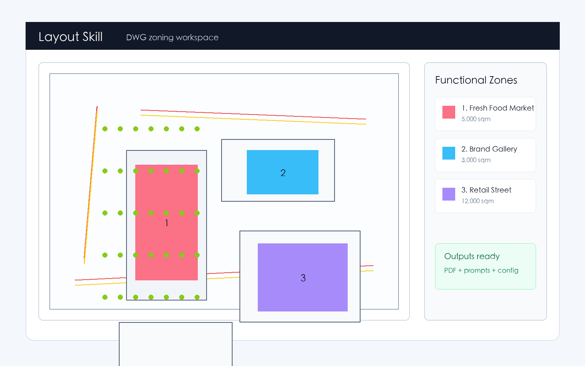
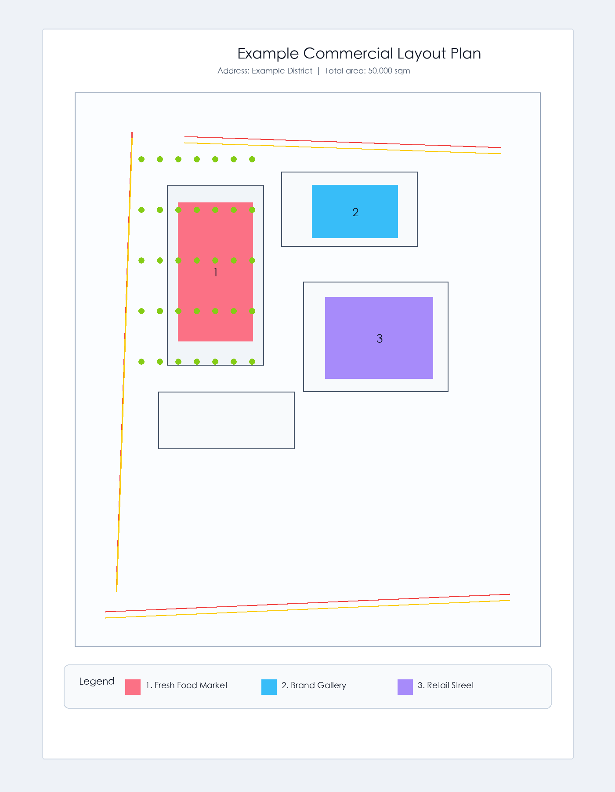
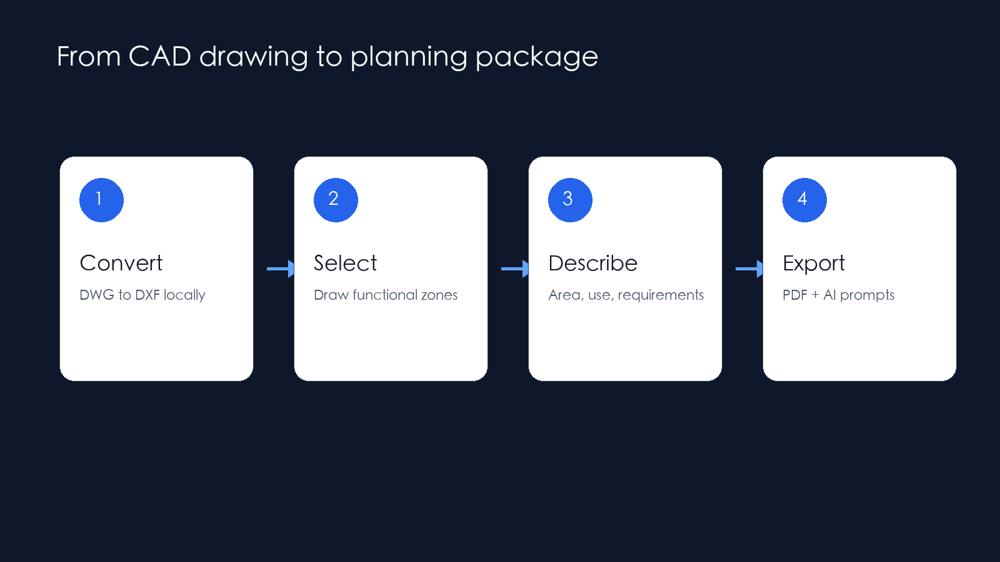

# Layout Skill

Turn DWG floor plans into planning PDFs and AI rendering prompts in minutes.

Layout Skill is a local-first workflow for commercial planning teams. It helps
you convert CAD drawings, mark functional zones visually, describe each zone,
export client-ready planning documents, and generate source-constrained AI
rendering prompts.

## Demo

[Watch the demo video](assets/layout-skill-demo.mp4)

## Features

- Local-first DWG to DXF conversion through ODA File Converter
- Optional CloudConvert fallback
- Browser-based zone selection
- Clean PDF planning sheet generation
- Source-constrained AI prompt export for Midjourney, DALL-E, Stable Diffusion, and similar tools
- Whole-plan AI reference maps and per-zone crop images for layout-faithful rendering
- Commercial source-available license for paid customers

## Who It Is For

- architecture studios
- commercial planning consultants
- retail leasing teams
- property operators
- renovation agencies

## Availability

Layout Skill is sold as a commercial source-available tool. Paid customers get:

- private repository access
- installation documentation
- update access for the current paid source repository

## Price

**USD $5 one-time** for the **Layout Skill License**.

## Buy

The live checkout link will be added after payment provider approval.

For pre-release access or purchase questions, email `godfufu@icloud.com`.

During checkout, enter your GitHub username so repository access can be granted
automatically.
